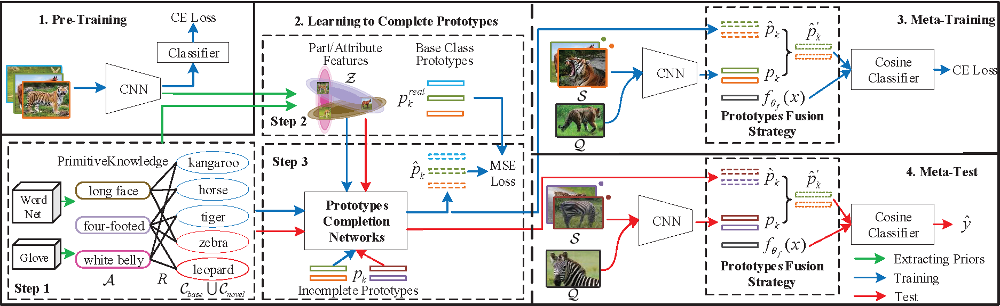

# Prototype Completion with Primitive Knowledge for Few-Shot Learning
This repository contains the code for the paper:
<br>
[**Prototype Completion with Primitive Knowledge for Few-Shot Learning**]()
<br>
Baoquan Zhang, Xutao Li, Yunming Ye, Zhichao Huang, Lisai Zhang
CVPR 2021
<p align='center'>
  
</p>

### Abstract

Few-shot learning is a challenging task, which aims to learn a classifier for novel classes with few examples. Pre-training based meta-learning methods effectively tackle the problem by pre-training a feature extractor and then fine-tuning it through the nearest centroid based meta-learning. However, results show that the fine-tuning step makes very marginal improvements. In this paper, 1) we figure out the key reason, i.e., in the pre-trained feature space, the base classes already form compact clusters while novel classes spread as groups with large variances, which implies that fine-tuning the feature extractor is less meaningful; 2) instead of fine-tuning the feature extractor, we focus on estimating more representative prototypes during meta-learning. Consequently, we propose a novel prototype completion based meta-learning framework. This framework first introduces primitive knowledge (i.e., class-level part or attribute annotations) and extracts representative attribute features as priors. Then, we design a prototype completion network to learn to complete prototypes with these priors. To avoid the prototype completion error caused by primitive knowledge noises or class differences, we further develop a Gaussian based prototype fusion strategy that combines the mean-based and completed prototypes by exploiting the unlabeled samples. Extensive experiments demonstrate that our method: (i) obtain more accurate prototypes; (ii) outperforms state-of-the-art techniques by $2\% \sim 9\%$ in terms of classification accuracy.

### Citation

If you use this code for your research, please cite our paper:
```
@inproceedings{zhang2021prototype,
  title={Prototype Completion with Primitive Knowledge for Few-Shot Learning},
  author={Baoquan Zhang and Xutao Li and Yunming Ye and Zhichao Huang and Lisai Zhang},
  booktitle={CVPR},
  year={2021}
}
```

## Code (coming soon)


## Acknowledgments

This code is based on the implementations of [**MetaOptNet**](https://github.com/kjunelee/MetaOptNet),  [**Meta-Learning with Differentiable Convex Optimization**]
